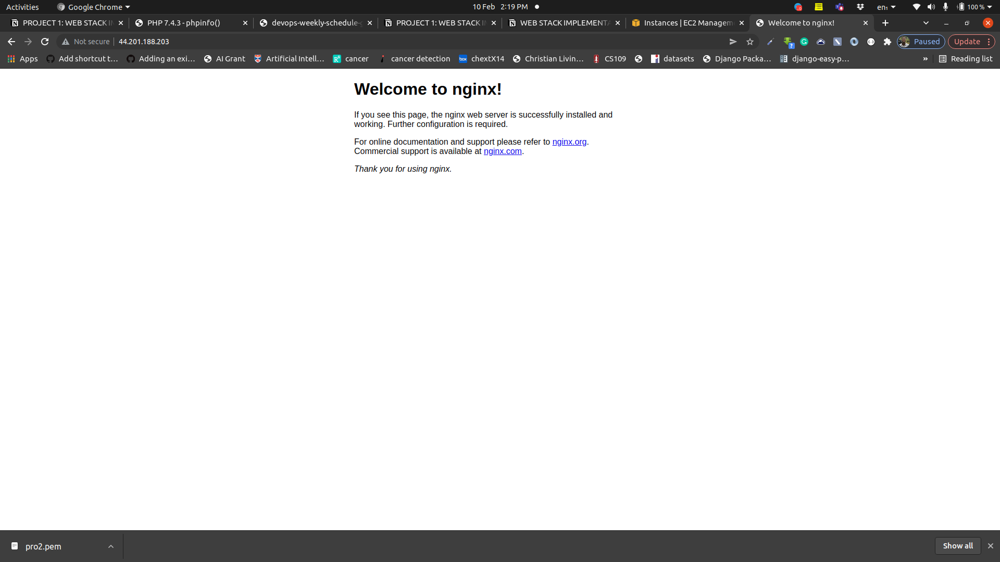

PROJECT 2 LEMP STACK
WEB STACK IMPLEMENTATION (LEMP STACK) project covers similar concepts as WEB STACK IMPLEMENTATION(Lamp stack) and helps to cement your skills of deploying Web solutions using LA(E)MP stacks.

You have done a great job with successful completion of WEB STACK IMPLEMENTATION(Lamp stack)

In this project i will implement a similar stack, but with an alternative Web Server - NGINX, which is also very popular and widely used by many websites in the Internet.

In order to complete this project you will need an AWS account and a virtual server with Ubuntu Server OS.

If you do not have an AWS account - go back to WEB STACK IMPLEMENTATION(Lamp stack) Step 0 to sign in to AWS free tier account and create a new EC2 Instance of t2.nano family with Ubuntu Server 20.04 LTS (HVM) image. Remember, you can have multiple EC2 instances, but make sure you STOP the ones you are not working with at the moment to save available free hours.

Hint: In previous project we used Putty on Windows to connect to our EC2 Instance, but there is a simpler way that do not require conversion of .pem key to .ppk - using Git Bash.

Download and install Git Bash like it is shown in this video.

Launch Git Bash and run following command:

ssh -i <Your-private-key.pem> ubuntu@<EC2-Public-IP-address>
